<h1 align="center">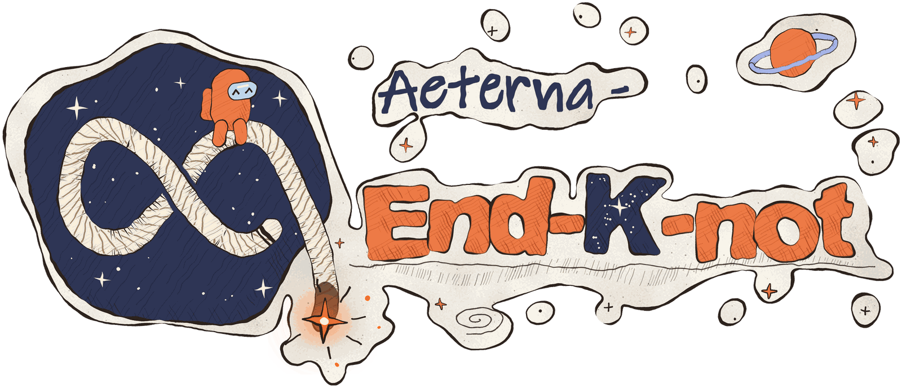</h1>

<p align="center">
  <b>The host installs it, and everyone else plays 682 roles on vanilla Among Us.</b>
</p>

<p align="center">
  <a href="README.md"></a>
  <a href="../../releases/latest"></a>
  
  <a href="./ROLES-EN.md"></a>
  
  <br>
  <a href="https://discord.gg/nnQMCEkHpC"></a>
  <a href="https://github.com/sponsors/waffle-ful"></a>
  <a href="./LICENSE"></a>
</p>

<p align="center">
  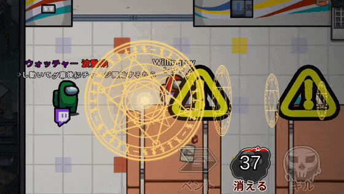
  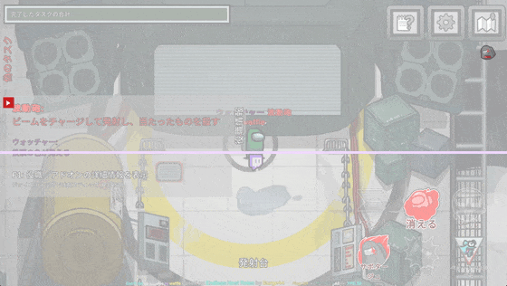
  <br><sub><b>Wave Cannon</b>: the role SuperNewRoles made famous. Left is the shooter's screen, right is the target's.<br>Players who also install End K not see the magic circles and the special-move cut-in as shown here.</sub>
</p>

<p align="center">
  <a href="../../releases/latest/download/EndKnotInstaller.exe"></a>
</p>

<p align="center">
  <b>↑ Click to download the installer. Close Among Us, then run it to install.</b><br>
  <sub>Prefer to unzip it yourself, or want an older build? Head to the <a href="../../releases/latest">releases page</a>.<br>
  If Windows shows a blue warning on first run, <a href="#if-windows-shows-a-blue-warning">follow these two steps</a>.</sub>
</p>

---

## What End K not does

<table>
<tr>
<td width="33%" valign="top">
<h3 align="center">🎮<br>Host-only<br>install</h3>
Everyone else joins on vanilla. You can gather players without asking them to "install this first." Official and custom servers both run the full feature set.
</td>
<td width="33%" valign="top">
<h3 align="center">🛡️<br>Lobby<br>recovery</h3>
If the server drops you, End K not <b>re-creates the lobby</b> with the same settings. If the game crashes, the bundled watchdog relaunches it and restores the lobby. You can leave it running unattended for a full day.
</td>
<td width="33%" valign="top">
<h3 align="center">📺<br>Streaming<br>tools</h3>
End K not reads each player's chat aloud <b>in its own voice</b>. Viewers <b>affect the game</b> with <code>!</code> commands from live chat. An <b>AI commentary companion</b> calls kills, meetings, and wins as they happen.
</td>
</tr>
</table>

### Example roles

<table>
<tr>
<td width="33%" valign="top" align="center">
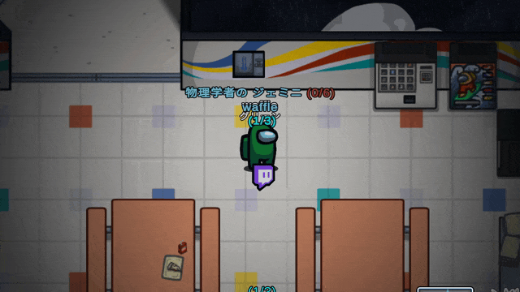
<h4>Gemini</h4>
Stand still and you leave a copy of yourself there, with your colour and name.
</td>
<td width="33%" valign="top" align="center">
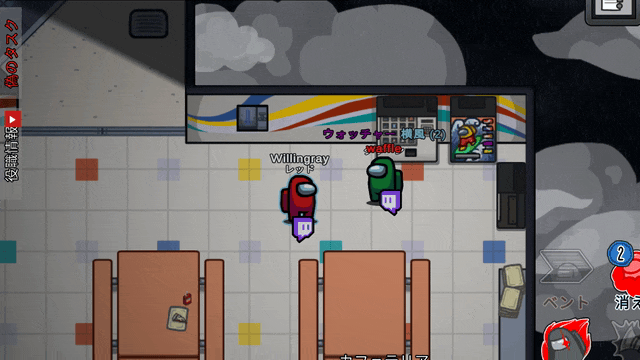
<h4>Crosswind</h4>
Turns invisible, then blows everyone sideways with a gust of wind.
</td>
<td width="33%" valign="top" align="center">
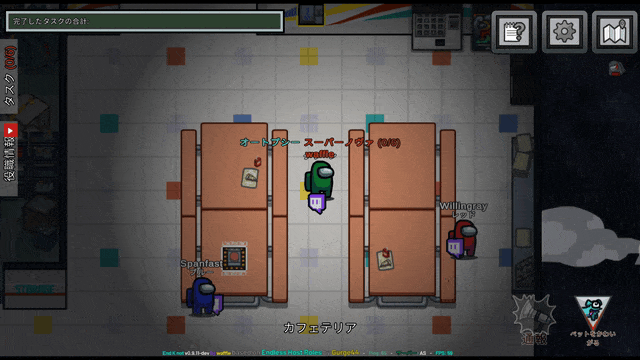
<h4>Supernova</h4>
Explodes if you stand still. Survive to the end and you win alone, in place of the team that would have won.
</td>
</tr>
<tr>
<td width="33%" valign="top" align="center">
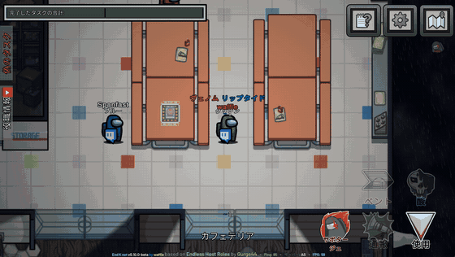
<h4>Riptide</h4>
Sends a giant wave across the map. Anyone it catches dies. The wave speeds up after each meeting.
</td>
<td width="33%" valign="top" align="center">
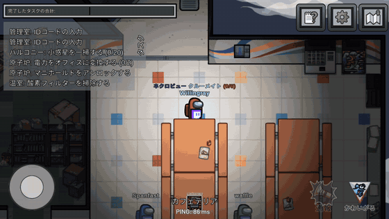
<h4>Caught in the wave</h4>
A wall of water fills the screen as it rolls toward you.
</td>
<td width="33%" valign="top" align="center">
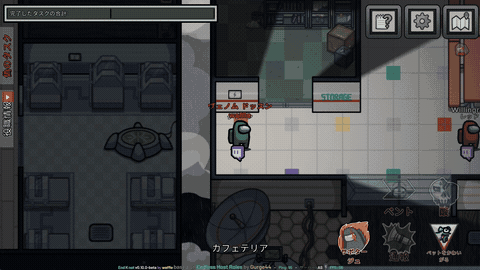
<h4>Dossun</h4>
Drops a giant block that follows your movement. Use it to crush players or knock them away.
</td>
</tr>
<tr>
<td colspan="3" valign="top" align="center">
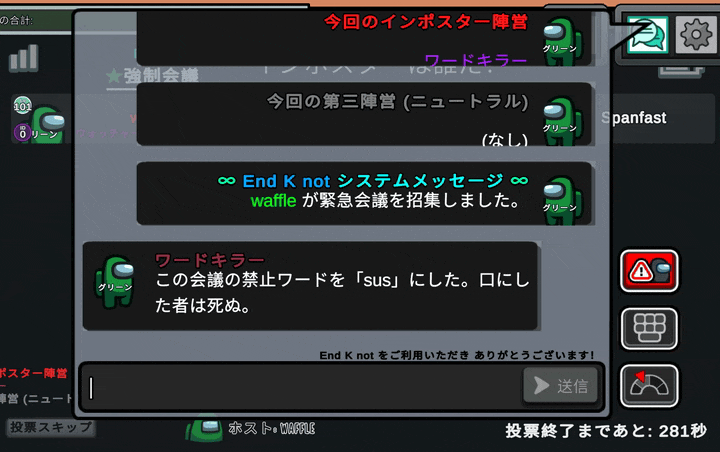
<h4>WordKiller</h4>
Sets a hidden forbidden word during the meeting. Anyone who says it dies on the spot.
</td>
</tr>
</table>

▶ **[See all 682 roles (`ROLES-EN.md`)](./ROLES-EN.md)**

### Easy to install, easy to remove

The installer detects Steam or Epic and installs the mod. To remove it, rename `winhttp.dll` in the game folder and you're back to **plain Among Us.**

<p align="center"><b>682 roles · 110+ chat commands · host-only install · Android support · completely free</b></p>

---

## About this mod

**End K not** is an unofficial personal fork for Among Us that inherits roles and systems from both [Endless Host Roles (EHR)](https://github.com/Gurge44/EndlessHostRoles) and [TownOfHost-K (TOHK)](https://github.com/KYMario/TownOfHost-K). On top of EHR's role engine, it adds features for **streaming, long-running hosting, and presentation.**

This mod is unofficial and is **not affiliated with or endorsed by Innersloth**. **Please do not contact Innersloth regarding any issues with this mod.**

> [!WARNING]
> End K not is in **beta**. Some roles are untested and several features are works-in-progress. Please report bugs and suggestions on [GitHub Issues](../../issues) or our [Discord](https://discord.gg/nnQMCEkHpC).

Supported Among Us version: **2026.8.18**

## Features

### 🎥 Streaming & long-running hosting

- **Per-crew text-to-speech (VOICEVOX integration)** — Reads each player's chat aloud in its own voice. The host's own copy of [VOICEVOX](https://voicevox.hiroshiba.jp/) generates the voices. You hear the audio on the host's machine (your stream), and End K not doesn't send it into the game. You can pin a voice to a player name or a friend code. *(See [Credits](#credits) for the attribution required when streaming.)*
- **Auto re-host & crash self-recovery** — When the official server kicks or drops the host, End K not builds a new lobby with the same region and the same settings. If Among Us crashes or hangs, the bundled external watchdog relaunches the game and restores the lobby. You can leave a stream running unattended for a full day.
- **BGM system** — The host can replace the music for menu / lobby / in-task / climax / meeting / result. Default tracks ship with the mod.
- **YouTube live chat overlay & auto-posting** — Draws your YouTube live chat over the game screen, and posts in-game events (kills, meetings, wins) back to that chat so viewers who look away still follow the round.
- **Viewer intervention system** — Viewers spend points on `!`-prefixed live chat commands to interfere with the game. Commands include `!大地震` (big earthquake — closes all doors, cuts power, and randomly teleports players), `!天の声` (voice of heaven — broadcasts a viewer's message to all players), and `!偽死体` (fake corpse — spawns a fake dead body near a living player).
- **AI commentary companion** — A separate AI process (Gemini Live) takes live game events and commentates through a 2D portrait with a lip-synced 3D avatar. It rotates through topics, so it doesn't repeat itself over a long stream.
- **On-screen lobby code bubble** — A small draggable bubble that keeps your lobby code on screen for the whole stream.

### 🏚️ Lobby presentation & worlds

- **Backrooms lobby** — A Backrooms-themed lobby. The host with the mod and players without it see different scenery.
- **EKM custom map editor** — End K not bundles an editor for building custom maps ([`editor/`](./editor)). You can load your maps in-game *(work in progress)*.
- **Lobby decorations** — Place decorations such as hot springs and portals in the lobby.

### 🎨 UI & policy

- **Calamity-themed main menu** *(work in progress)* — A custom Calamity-style title screen (referencing [CalamityModPublic](https://github.com/CalamityTeam/CalamityModPublic)).
- **GPL-3.0 open source** — The full source is public. You can study, modify, and redistribute it under GPL-3.0.

## Performance

We aim to keep boot time and resident memory close to vanilla. You'll find the test conditions and every metric in the **[performance report](https://waffle-ful.github.io/Aeterna-End-K-not/perf.html)** (Japanese).

<details>
<summary><b>Show the measurements (boot time, resident memory and frame time)</b></summary>

We measured "vanilla / BepInEx only / current 0.11.1 dev build" with the same procedure on the same PC (2026-10-02 to 03, Among Us 2026.9.29 on Steam). The table shows medians.

| Metric | Vanilla | BepInEx only | Current 0.11.1 dev |
|---|---:|---:|---:|
| Boot time (s) | 5.2 | 7.0 | **4.4** |
| Time to login complete (s) | 9.9 | 11.6 | **10.4** |
| Lobby resident memory (MB) | 532 | 658 | **779** |
| Lobby 1% low (fps) | 57.4 | 56.7 | **54.6** |
| Lobby frame time p95 (ms) | 17.01 | 17.01 | **17.16** |
| In-game resident memory (MB) | 629 | 703 | **985** |
| In-game 1% low (fps) | 56.7 | 56.5 | **54.4** |
| In-game frame time p95 (ms) | 17.14 | 17.07 | **17.30** |

<p align="center">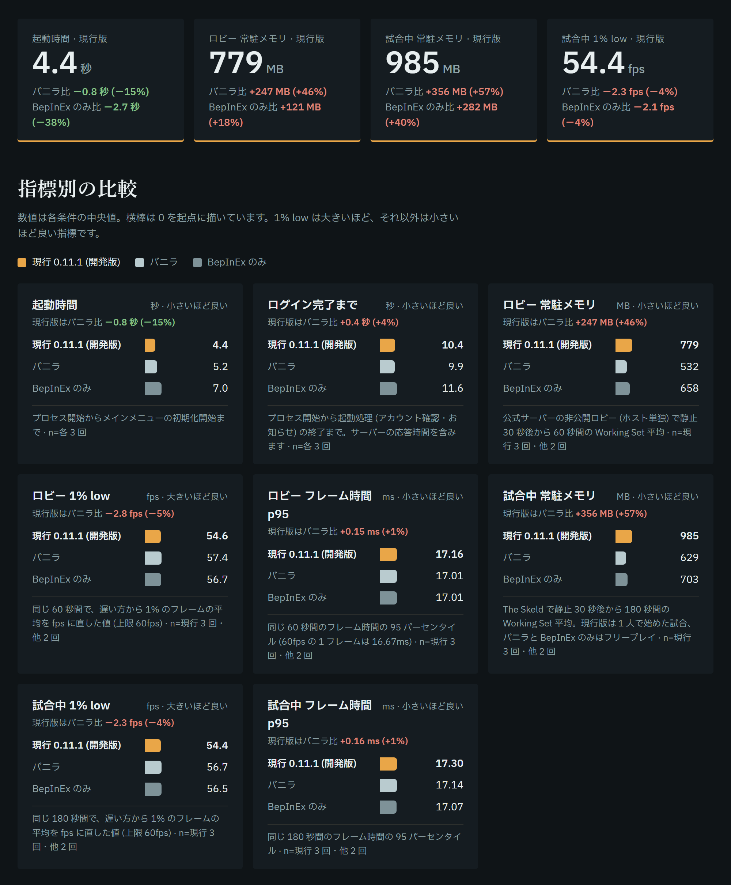</p>

Boot time runs until the main menu starts initializing. Lobby is a private lobby on the official servers with the host alone, in-game is The Skeld, both sampled while standing still (60 fps cap). In-game uses a one-player match for the current build and Freeplay for vanilla and BepInEx only. The current-build numbers come from a development build. The published build leaves out the developer notice banner and diagnostics, so it runs lighter than this.

Earlier boot times were 16.4 s for v0.9.6 and 11.1 s for v0.9.7 (measured 2026-09-05 on the Epic build of 2026.8.18; vanilla was 5.9 s in that run).

</details>

## Role list

**682 roles in total.** Breakdown by faction:

| Faction | Count |
|---------|-------|
| Impostor | 170 (vanilla 4 + remake 4 + custom 162) |
| Crewmate | 178 (vanilla 6 + remake 7 + custom 165) |
| Neutral | 137 |
| Coven | 21 |
| Game mode exclusive | 28 |
| Other | 2 (GM / Convict) |
| Sub-roles (add-ons) | 146 |

▶ **[See the full list of all 682 roles (`ROLES-EN.md`)](./ROLES-EN.md)**

Use `/r <role name>` or `/myrole` in-game to read each role's effects and settings. [The top of this page](#example-roles) shows a few of the flashiest roles.

## Commands

End K not adds over 110 chat commands across the host, moderator, and player tiers. See [`COMMANDS.md`](./COMMANDS.md) for the full list. Run `/help` in-game to see only the commands available in your current context.

## Installation

**Only the host needs the mod.** Other players join without installing anything.

### Installer (easiest, recommended)

1. **[Download `EndKnotInstaller.exe`](../../releases/latest/download/EndKnotInstaller.exe)**
2. **Fully close Among Us**, then run it
3. The installer detects Steam / Epic and installs the mod (updates work the same way)

#### If Windows shows a blue warning

The installer isn't code-signed, so the first run brings up a blue "**Windows protected your PC**" screen. Windows shows that screen for any unsigned exe from an individual developer. It does not mean a virus was detected.

1. Click "**More info**"
2. Click the "**Run anyway**" button that appears

If you'd rather verify the file first, run this in PowerShell:

```powershell
Get-FileHash "$env:USERPROFILE\Downloads\EndKnotInstaller.exe"
```

If the value matches the `sha256:` shown next to `EndKnotInstaller.exe` on the [releases page](../../releases/latest), nobody has tampered with the file.

> [!TIP]
> If you'd rather not run an exe, the manual zip install below installs the same files.

<details>
<summary><b>Manual zip install · DLL-only update</b></summary>

### Manual zip install

1. Download the zip for your store from [Releases](../../releases)
   - Steam: `EndKnot-<version>_Steam.zip`
   - Epic: `EndKnot-<version>_Epic.zip`
2. **Fully close Among Us**
3. Extract **everything** from the zip into your Among Us installation folder, overwriting existing files
   - Steam: `<Steam>\steamapps\common\Among Us\`
   - Epic: `C:\Program Files\Epic Games\AmongUs\`
4. Launch Among Us

The zip includes BepInEx, the config files, and the custom-region mod, so you need nothing else.

### DLL-only update (for existing installs)

If you already have End K not installed, overwrite `Among Us\BepInEx\plugins\EndKnot.dll` with the one from Releases and delete `Among Us\BepInEx\interop\`.

</details>

> [!IMPORTANT]
> **When updating, delete the `Among Us\BepInEx\interop\` folder** before extracting the new version. A stale interop folder can prevent the game from starting.

### Switching back to vanilla

Rename `winhttp.dll` in your `Among Us` folder to `winhttp.dll.disabled`. The game then launches as plain Among Us. Rename it back to re-enable.

### Playing on Android (launcher)

You can host from your phone too. The game itself stays unmodified; the launcher starts it with the mod loaded.

1. Install the official store version of Among Us on an Android 8.1+ arm64 device
2. **[Download `EndKnot-<version>_Android.apk`](../../releases/latest)** and install it (you'll need to allow installs from unknown sources)
3. Open the launcher and grant the "All files access" permission it asks for on first run
4. The game launches automatically after a few seconds (tap the card to launch right away)

To update, install the new APK over the old one. The launcher's "Get the update" button also takes you to Releases.

## BGM customization

Hosts can replace the bundled music with their own:

- Location: `Among Us/BepInEx/resources/BGM/`
- Supported formats: `.ogg` / `.mp3` / `.wav`
- Supported slots: `menu` / `lobby` / `intask` / `climax` / `meeting` / `result`
- Example filenames: `menu.ogg`, `lobby.mp3`

Edit `bgm_titles.json` to control title / author display while a BGM plays. End K not plays your file for a slot if one exists, and the bundled track otherwise.

## Community

- **Discord**: https://discord.gg/nnQMCEkHpC — bug reports, questions, general chat (preferred)
- **Issues**: [GitHub Issues](../../issues) — may take a while to respond
- [`CODE_OF_CONDUCT.md`](.github/CODE_OF_CONDUCT.md) | [`CONTRIBUTING.md`](.github/CONTRIBUTING.md) | [`SECURITY.md`](.github/SECURITY.md) | [`SUPPORT.md`](.github/SUPPORT.md)

## Team

End K not is run by the following members.

| Member | Role | Link |
|---|---|---|
| Chinese-made Waffle (中国産わっふる) | Development & maintenance | [YouTube](https://www.youtube.com/@wafflewafflewafflewafflewaffle) |
| Tora-kun no Ie (トラ君の家) | Outreach & PR | [YouTube](https://www.youtube.com/@taizen-q3j) |
| Chaco (チャコ) | Outreach & PR | — |

> The code modification history can be traced through this repository's git log and [`CHANGELOG.md`](./CHANGELOG.md).

## Funding & Donations

End K not is a **free, GPL-3.0 mod**. All features stay free, and donations are optional.

Donations go toward the costs of keeping End K not in development, such as development tools. Donors get the same features and support as everyone else.

▶ **[About donations (`FUNDING.md`, Japanese)](.github/FUNDING.md)**

<p align="center">
  <a href="https://github.com/sponsors/waffle-ful"></a>
</p>

### 💖 Sponsors

The people keeping End K not going (listed only if they wish).

No sponsors yet. We'd love for you to be the first!

## License

End K not is released under the **GNU General Public License v3.0**. See [`LICENSE`](./LICENSE) for details.

End K not is a derivative of [Endless Host Roles](https://github.com/Gurge44/EndlessHostRoles) and [TownOfHost-K](https://github.com/KYMario/TownOfHost-K). waffle-ful has made the **modifications since April 2026**; you can trace the modification history in this repository's git log and [`CHANGELOG.md`](./CHANGELOG.md), in compliance with GPL-3.0 §5.

## Credits

> **The vast majority of this mod's roles and features come from earlier mods.** Huge thanks to the developers of the projects below.

<details>
<summary><b>Show all credits (earlier mods · developers and translators · bundled software · music and assets)</b></summary>

- **[astra1dev](https://github.com/astra1dev)** — advice on IMGUI window display settings
- **[au.libhalt.net](https://au.libhalt.net/)** — an Among Us mod information and distribution site
- **[AutoRejoin](https://github.com/Maxi0fc/AutoRejoin)** (Maxi0fc) — a client mod that adds automatic rejoining after a disconnect
- **[BetterAmongUs](https://github.com/D1GQ/BetterAmongUs)** (D1GQ, GPL-3.0) — the modded-client support flag list
- **[Calamity Mod (Terraria)](https://github.com/CalamityTeam/CalamityModPublic)** (Calamity Team) — reference for the main menu theme and visual design
- **[CrowdedMod](https://github.com/CrowdedMods/CrowdedMod)** (andry08 / CrowdedMods, MIT) — large-lobby support
- **[Endless Host Roles](https://github.com/Gurge44/EndlessHostRoles)** (Gurge44 et al., GPL-3.0) — base mod: the role engine, the large majority of roles, and an ongoing source of bug fixes
- **[ExtremeRoles](https://github.com/yukieiji/ExtremeRoles)** (yukieiji) — Airship patches
- **[Game Optimizer (CPUs / Threads Optimizer)](https://github.com/charlie754/Game-Optimizer-CPUs-Threads-Optimizer)** (charlie754, MIT) — the idea of isolating cache domains with CPU Sets (the `CpuSetsMode` setting); our code is written directly against the Win32 API
- **ImaMapleTree / 단풍잎 / Tealeaf** — ability activation via the pet button
- **[Lotus (LotusContinued)](https://github.com/Lotus-AU/LotusContinued)** / [NikoCat233 fork](https://github.com/NikoCat233/LotusContinued) (GPL-3.0) — settings-conflict detection with host warnings, whitelist join restriction
- **[MalumMenu](https://github.com/scp222thj/MalumMenu)** (scp222thj, GPL-3.0) — player position dots on the minimap
- **[Mini.RegionInstall](https://github.com/miniduikboot/Mini.RegionInstall)** (miniduikboot, GPL-3.0) — custom region installer
- **[MiraAPI](https://github.com/All-Of-Us-Mods/MiraAPI)** (All-Of-Us-Mods, LGPL-2.1) — UI sprites (two next-page buttons, two checkmarks)
- **[More Gamemodes](https://github.com/Rabek009/MoreGamemodes)** (Rabek009) — Custom Net Objects (CNO), chat control and clearing, player-control helper code
- **[Nebula on the Ship (NoS)](https://github.com/Dolly1016/Nebula)** / [source code (Nebula-Public)](https://github.com/Dolly1016/Nebula-Public) (Dolly1016 et al., GPL-3.0; NebulaAPI is LGPL-3.0) — disabling incremental GC and running GC ahead of time; a mod with many roles of its own and its own API
- **[Reactor](https://github.com/NuclearPowered/Reactor)** / [XtraCube fork](https://github.com/XtraCube/Reactor) — modded handshake, compiler-generated object and state machine wrappers, disabling the 5s timeout on custom servers
- **[Revolutionary Host Roles](https://github.com/sansaaaaai/Revolutionary-host-roles)** (sansaaaaai) — a TOH-lineage mod adding its own roles and host-side features
- **[Stellar Roles](https://github.com/Mr-Fluuff/StellarRolesAU)** (Mr-Fluuff) — an Among Us role mod with a large set of original roles
- **[Submerged](https://github.com/SubmergedAmongUs/Submerged)** (SubmergedAmongUs) — map select button handling for Submerged
- **[SuperNewRoles](https://github.com/SuperNewRoles/SuperNewRoles)** / [ykundesu repo](https://github.com/ykundesu/SuperNewRoles) (SuperNewRoles team, GPL-3.0) — WaveCannon, search mod game, logo and stamp display, device usage restriction, video display handling, some roles
- **[template-unity](https://github.com/vpmedia/template-unity)** (vpmedia, MIT) — reference for the Mersenne Twister implementation
- **[TheOtherRoles](https://github.com/TheOtherRolesAU/TheOtherRoles)** — Submerged detection handling
- **[TheOtherRoles-GM](https://github.com/yukinogatari/TheOtherRoles-GM)** (yukinogatari) — a TheOtherRoles derivative
- **TOR_GM_Haoming_Edition** — a TheOtherRoles-GM derivative
- **[TOHEX / TONEX](https://github.com/TOHEX-Official/TownOfHostEdited-Xi)** — a host mod in the Town Of Host Edited lineage
- **[TOU-Mira](https://github.com/AU-Avengers/TOU-Mira)** (AU-Avengers, GPL-3.0) — dleks map selection, kill button cooldown display
- **[Town Of Host](https://github.com/tukasa0001/TownOfHost)** (tukasa0001 et al.) — the root of the whole lineage; sabotage system handling
- **[Town Of Host-H](https://github.com/Hyz-sui/TownOfHost-H)** (Hyz-sui) — a Town Of Host derivative host mod
- **[Town Of Host-K](https://github.com/KYMario/TownOfHost-K)** (KYMario et al., GPL-3.0) — source of many ported roles, streaming-support features, the official-server packet-splitting safety net, device usage time limits
- **[Town Of Host Re-Edited](https://github.com/Loonie-Toons/)** — EHR's fork origin
- **[Town Of Host_ForE](https://github.com/AsumuAkaguma/TownOfHost_ForE)** (AsumuAkaguma, GPL-3.0) — BGM customization, chat character-type restriction (WordLimit), meeting start reason notification
- **[Town Of Host_Y](https://github.com/Yumenopai/TownOfHost_Y)** (Yumenopai) — some roles, settings UI, zoom handling
- **[Town of Host: Enhanced (TOHE)](https://github.com/EnhancedNetwork/TownofHost-Enhanced)** (The Enhanced Network team, GPL-3.0) — friend-code matching on join; a host mod with a large set of original roles
- **[Town Of Host Edited / Town Of Next](https://github.com/KARPED1EM/TownOfNext)** / [TownOfHostEdited](https://github.com/KARPED1EM/TownOfHostEdited) / [TownOfNext](https://github.com/TownOfNext/TownOfNext) (KARPED1EM, GPL-3.0) — EHR's predecessor in the lineage; the in-game role info menu
- **[Town Of Next: Edited (TONE)](https://github.com/qin-qwq/TownofNext-Edited)** (qin-qwq, GPL-3.0) — vent network map display (via [TownOfNext](https://github.com/TownOfNext/TownOfNext), [TOU-Mira](https://github.com/AU-Avengers/TOU-Mira) and [MalumMenu](https://github.com/scp222thj/MalumMenu))
- **[Town-Of-Moss](https://github.com/Koke1024/Town-Of-Moss)** (Koke1024) — reactor meltdown boost
- **[Town Of Us - Reactivated](https://github.com/eDonnes124/Town-Of-Us-R)** (eDonnes124, GPL-3.0) — host meeting display
- **Town of Us Rewritten** (Det) — Discord activity (rich presence) display
- **[TownOfHost-Optimized](https://github.com/Limeau/TownofHost-Optimized)** (Limeau) — a Town Of Host derivative focused on optimization
- **[TownOfHost-Pko](https://github.com/satokazoku/TownOfHost-Pko)** (satokazoku et al., GPL-3.0) — source of many ported roles, WaveCannon design reference, direct numeric input for settings, consecutive-join kick, auto abort
- **[TownOfHost-TheOtherRoles](https://github.com/music-discussion/TownOfHost-TheOtherRoles)** / [discus-sions repo](https://github.com/discus-sions/TownOfHost-TheOtherRoles) (music-discussion) — split RPC packs, meeting screen handling
- **[TownOfHost-hamo](https://github.com/rar006/TownOfHost-hamo)** (rar006, GPL-3.0) — coming-out feature (`/co`, `/aco`, `/colist`)
- **[TownOfHostPlus](https://github.com/SkullCreeper/TownOfHostPlus)** (SkullCreeper) — a Town Of Host derivative adding its own roles
- **[TownOfPlus](https://github.com/tugaru1975/TownOfPlus)** (tugaru1975) — zoom
- **[UnityDoorstop](https://github.com/NeighTools/UnityDoorstop)** (NeighTools, LGPL-2.1) — `winhttp.dll` / `doorstop_config.ini` used for packaging
- **[Vanilla Enhancements](https://github.com/xChipseq/VanillaEnhancements)** (xChipseq, GPL-3.0) — a client mod that improves vanilla quality of life

### Thanks to the developers and translators

**[Endless Host Roles](https://github.com/Gurge44/EndlessHostRoles)**

- Developers: Gurge44
- Contributors: Dx / PH_Gaming / TommyXL / Drakos / PEPPERcula
- Special Thanks: Seleneous / thewhiskas27 / HyperAtill / Sil
- Translators: Dx (PT-BR) / PH_Gaming (PT-BR) / Tomix (PT-BR) / HyperAtill (RU) / ABoringCat (ZH-CN) / Reborn (ZH-CN) / Pomelo (ZH-TW) / Polan (JP) / DoArc (ES) / Kurma (ID) / Gurge44 (HU) / Æ (KO)

> This mod's `Resources/Lang/` is inherited from EHR, so the translators' work above is included as-is.

**[TownOfHost-K](https://github.com/KYMario/TownOfHost-K)**

- Developers: 暇な人 KY/けーわい / タイガー / 夜藍 / ねむa / はろん
- Supporter: りぃりぃ

### Bundled third-party software

Some components are embedded into `EndKnot.dll`, others ship inside the release packages. All of them are the work of their respective authors and are licensed separately from End K not itself (GPL-3.0). The full list and license texts live in [`THIRD-PARTY-NOTICES.md`](./THIRD-PARTY-NOTICES.md).

- NVorbis (MIT) — Ogg Vorbis decoding
- NLayer (MIT) — MP3 decoding
- BepInEx / Unity Doorstop (LGPL-2.1), Il2CppInterop (LGPL-3.0) — the mod loading stack
- HarmonyX / MonoMod / Mono.Cecil / AsmResolver / Cpp2IL / Iced and others (MIT), Dobby (Apache-2.0) — libraries used by the loading stack
- .NET runtime (MIT) — the runtime the mod runs on
- Python with its packages, three.js and others — the AI commentary companion

### Music Credits

BGM by **自称芸術家みーさん (Miisan)**
- [HURT RECORD](https://www.hurtrecord.com/bgm/46/zero-no-heya.html)

BGM by **もっぴーさうんど (Moppy Sound)**, **こおろぎ (Kohrogi)**, **蒲鉾さちこ (Kamaboko Sachiko)**
- [DOVA-SYNDROME](https://dova-s.jp/)

### Sound Effect Credits

Some sound effects use material from:
- On-Jin ～音人～ ([https://on-jin.com/](https://on-jin.com/))
- [DOVA-SYNDROME](https://dova-s.jp/)
- [Pixabay](https://pixabay.com/)

### Video Asset Credits

- [みりんの動画素材 (Miirriin)](https://miirriin.com/)

</details>

### VOICEVOX (text-to-speech)

The per-crew read-aloud feature uses **[VOICEVOX](https://voicevox.hiroshiba.jp/)**, free Japanese text-to-speech software. End K not bundles no voice data. It has the VOICEVOX installed on the host's PC generate speech at runtime.

> [!IMPORTANT]
> **If you publish the generated audio in a stream or recording, you must credit both VOICEVOX and the character(s) used.**
> Example: `VOICEVOX:ずんだもん (Zundamon)`
> Each character has its own individual terms of use, so please review the [VOICEVOX terms](https://voicevox.hiroshiba.jp/term/) and each character's terms.

The available characters depend on the VOICEVOX voices the host has installed (End K not writes the installed voices and their IDs to `BepInEx/config/EndKnot_VoiceVox_Speakers.txt`). Credits for all VOICEVOX characters:

<details>
<summary><b>All VOICEVOX characters</b></summary>

四国めたん (Shikoku Metan) / ずんだもん (Zundamon) / 春日部つむぎ (Kasukabe Tsumugi) / 雨晴はう (Amehare Hau) / 波音リツ (Namine Ritsu) / 玄野武宏 (Kurono Takehiro) / 白上虎太郎 (Shirakami Kotaro) / 青山龍星 (Aoyama Ryusei) / 冥鳴ひまり (Meimei Himari) / 九州そら (Kyushu Sora) / もち子さん (Mochiko-san) / 剣崎雌雄 (Kenzaki Mesuo) / WhiteCUL / 後鬼 (Goki) / No.7 / ちび式じい (Chibishiki-jii) / 櫻歌ミコ (Ouka Miko) / 小夜/SAYO / ナースロボ＿タイプＴ (Nurserobo Type-T) / †聖騎士 紅桜† (Holy Knight Benizakura) / 雀松朱司 (Suzumatsu Akashi) / 麒ヶ島宗麟 (Kigashima Sorin) / 春歌ナナ (Haruka Nana) / 猫使アル (Nekotsuka Aru) / 猫使ビィ (Nekotsuka Bii) / 中国うさぎ (Chugoku Usagi) / 栗田まろん (Kurita Maron) / あいえるたん (Aierutan) / 満別花丸 (Manbetsu Hanamaru) / 琴詠ニア (Kotoyomi Nia) / Voidoll / ぞん子 (Zonko) / 中部つるぎ (Chubu Tsurugi) / 離途 (Rito) / 黒沢冴白 (Kurosawa Saehaku) / ユーレイちゃん (Yurei-chan) / 東北ずん子 (Tohoku Zunko) / 東北きりたん (Tohoku Kiritan) / 東北イタコ (Tohoku Itako) / あんこもん (Ankomon) / 夜語トバリ (Yogatari Tobari) / 暁記ミタマ (Akatsuki Mitama) / 里石ユカ (Satoishi Yuka)

</details>

For per-role porting credits, see [`CHANGELOG.md`](./CHANGELOG.md) and individual commit messages.

---

This mod is not affiliated with Among Us or Innersloth LLC, and the content contained therein is not endorsed or otherwise sponsored by Innersloth LLC. Portions of the materials contained herein are property of Innersloth LLC. © Innersloth LLC. Among Us is © 2018–2026 Innersloth LLC.
