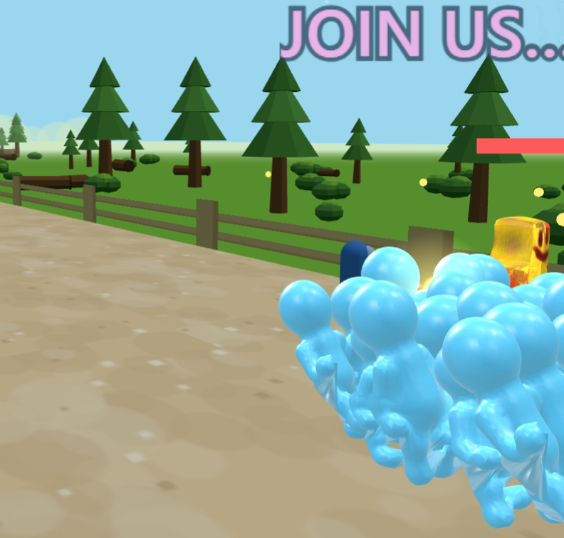

# End K not

<p align="center">
  
</p>

[English](README-EN.md)

<p align="center">
  <a href="../../releases/latest/download/EndKnotInstaller.exe"></a>
</p>

<p align="center">
  <b>↑ クリックするとインストーラーが落ちてきます。Among Us を終了して実行するだけで導入完了です。</b><br>
  <sub>zip を自分で展開したい方・過去バージョンが欲しい方は <a href="../../releases/latest">リリースページ</a>から。<br>
  初回起動時に Windows の青い警告が出ますが、<a href="#windows-の青い警告が出たときは">対処法はこちら</a>。</sub>
</p>

[](https://discord.gg/sEYAFzD3a)

## このMod について

**End K not** は、[Endless Host Roles (EHR)](https://github.com/Gurge44/EndlessHostRoles) をベースとした Among Us の非公式個人フォークです。現在 **673 の役職**を実装しています。

ホストのクライアントに導入するだけで動作し、他のプレイヤーは Mod を導入せずに追加役職を楽しめます。公式サーバー・カスタムサーバーのどちらでもフルに動作します。

このMod は非公式のものであり、Among Us の開発元である Innersloth は一切関与していません。**このMod の問題に関して Innersloth へ問い合わせないでください。**

> [!WARNING]
> End K not は **alpha 段階**です。未テスト役職や WIP 機能を含みます。不具合報告や提案は [GitHub Issues](../../issues) または [Discord](https://discord.gg/sEYAFzD3a) へお願いします。

対応 Among Us バージョン : **2026.3.31**

## End K not の特徴

End K not は EHR の役職エンジンの上に、**配信・長時間運用・演出**まわりの機能を積み上げた個人フォークです。

> 役職の大半は EHR や TownOfHost 系列など先行 Mod の実装を引き継いだもの・参考に再実装したものです。各 Mod への謝辞は[クレジット](#クレジット)にまとめています。

### 🎥 配信・長時間運用サポート

- **クルーごとの声で自動読み上げ (VOICEVOX 連携)** — プレイヤーのチャットを、一人ひとり別々の声で自動読み上げします。ローカルにインストールした [VOICEVOX](https://voicevox.hiroshiba.jp/) に喋らせる仕組みで、音声はホストの手元（配信画面）だけで再生され、ゲームには一切送信されません。声はプレイヤー名やフレンドコードで固定割り当ても可能です。*（配信で使う際のクレジット表記については[クレジット](#クレジット)を参照）*
- **自動部屋立て直し & クラッシュ自己復帰** — 公式サーバーの kick や通信エラーで切断されても、同じリージョン・同じ設定で自動的に新しい部屋を立て直します。さらに Among Us 本体がクラッシュ／ハングしても、付属の外部ウォッチドッグ（番犬）が検知して自動で再起動し、部屋を復旧。24 時間ソークや長時間配信でも、放置したまま回り続けます。
- **BGM システム** — メニュー / ロビー / 任務中 / 会議 / 結果画面の BGM をホストが自由に差し替え可能。デフォルト BGM 同梱。
- **YouTube ライブチャット表示 & 自動投稿** — 配信中の YouTube ライブチャットをゲーム画面上にオーバーレイ表示。ゲーム内の実況イベント（キル・会議・勝敗など）をライブチャットへ自動投稿し、視聴者との一体感を演出します。
- **視聴者干渉システム** — 視聴者がライブチャットの `!` コマンドでゲームに介入できる仕組み。ポイント経済制で、`!大地震`（全ドア閉鎖＋停電＋プレイヤーをランダム TP）、`!天の声`（視聴者の一言を「天の声」名義で全員に送信）、`!偽死体`（生存者のそばに偽の死体を出現）などの干渉が可能です。
- **AI 実況相棒** — 別プロセスで動く AI（Gemini Live）がゲームの進行イベントを受け取り、立ち絵・3D アバター（口パク付き）でリアルタイムに実況してくれます。話題のローテーションと反復抑制で長時間配信でも実況がマンネリ化しにくい設計です。
- **配信用ロビーコードバブル** — 配信画面に常時ロビーコードを表示するドラッグ可能な IMGUI バブル。

### 🏚️ ロビー演出・ワールド

- **Backrooms ロビー** — Backrooms をテーマにした特別なロビー演出。Mod を入れているホストと、入れていない参加者とで見え方が変わる非対称表示を実現しています。
- **EKM カスタムマップエディタ** — カスタムマップを作れる専用エディタを同梱（[`editor/`](./editor)）。作ったマップをゲーム内で読み込めます *(開発中)*。
- **リップタイド (Riptide)** — マップ全体を覆う巨大な波が押し寄せ、のまれると即死。会議のたびに波が加速していく、ド派手なインポスター役職。
- **ロビー装飾** — ロビーに温泉やポータルなどの装飾を配置できます。

### 🎨 UI・ポリシー

- **Calamity (Terraria) テーマのメインメニュー** *(開発中)* — Calamity 風カスタムメインメニュー UI を実装中（[CalamityModPublic](https://github.com/CalamityTeam/CalamityModPublic) を参考）。
- **外部通信の無効化** — EHR 上流が行っていた実績 API・オンラインプリセット・ニュース取得などの通信を無効化。自 Mod の更新確認（GitHub API）と Bard・アナグラム等の一部役職ゲーム機能を除き、外部への通信は行いません。
- **GPL-3.0 オープンソース** — ソースコード全公開、改変・再配布自由。

## 役職一覧

実装済みは合計 **673 役職**。陣営ごとの内訳は以下のとおりです。

| 陣営 | 役職数 |
|------|-------|
| インポスター | 166 (ヴァニラ4 + リメイク4 + カスタム158) |
| クルーメイト | 176 (ヴァニラ6 + リメイク7 + カスタム163) |
| ニュートラル | 134 |
| カバン (Coven) | 21 |
| ゲームモード専用 | 28 |
| その他 | 2 (GM / Convict) |
| サブ役職（アドオン） | 146 |

▶ **[全 673 役職の名前一覧はこちら (`ROLES.md`)](./ROLES.md)**

各役職の効果や設定は、ゲーム内で `/r <役職名>` または `/myrole` を実行すると読めます。

### 注目役職

| 役職 | 陣営 | どんな役職？ |
|---|---|---|
| **リップタイド (Riptide)** | インポスター | 会議のたびに波を起こし、プレイヤーを流して溺れさせる。 |
| **ドッスン (Dossun)** | インポスター | 巨大ブロックを設置し、自分が動くと連動して動く。轢いたり吹き飛ばしたり。 |
| **ワードキラー (WordKiller)** | インポスター | 禁じた言葉を口にした者を消す。会話そのものが地雷原になります。 |
| **横風 (Crosswind)** | インポスター | 姿を消して突風を起こし、全員をまとめて横に吹き飛ばす。 |
| **ジェミニ (Gemini)** | クルーメイト | 立ち止まると、さっきまで居た場所に自分の分身が残る。色も名前も自分そっくり。 |
| **スーパーノヴァ (Supernova)** | ニュートラル | 超新星爆発を起こす。 |

派手さで選んだおすすめです。実装済みの全 682 役職は [`ROLES.md`](./ROLES.md) にまとめています。


## コマンド一覧

ホスト/モデレーター/全員が使えるチャットコマンドを 110 種類以上実装しています。詳細は [`COMMANDS.md`](./COMMANDS.md) を参照してください。ゲーム内で `/help` を実行すると、現在の状況で使えるコマンドだけが表示されます。

## インストール

**ホストのみ導入すれば動作します。** 参加者は Mod 不要です。

### インストーラーで導入（いちばんかんたん・推奨）

1. **[`EndKnotInstaller.exe` をダウンロード](../../releases/latest/download/EndKnotInstaller.exe)**
2. **Among Us を完全に終了して**から実行
3. Steam / Epic を自動判別してインストールまで全部やってくれます（更新も同じ手順）

#### Windows の青い警告が出たときは

インストーラーはコード署名をしていないため、初回実行時に「**WindowsによってPCが保護されました**」という青い画面が出ます。マルウェアだから出ているわけではなく、**署名のない個人配布の exe すべてに出る警告**です。

1. 「**詳細情報**」をクリック
2. 出てきた「**実行**」ボタンをクリック

心配な方は、実行前にファイルが本物か確認できます。PowerShell で以下を実行し、

```powershell
Get-FileHash "$env:USERPROFILE\Downloads\EndKnotInstaller.exe"
```

表示された値が [リリースページ](../../releases/latest) の `EndKnotInstaller.exe` の横に載っている `sha256:` と一致すれば、改変されていない配布物です。

> [!TIP]
> それでも exe を実行したくない場合は、下の「zip を手動展開して導入」でも同じものが入ります。

### zip を手動展開して導入

1. [Releases](../../releases) から、お使いのストア版の zip をダウンロード
   - Steam 版 : `EndKnot-<バージョン>_Steam.zip`
   - Epic 版 : `EndKnot-<バージョン>_Epic.zip`
2. **Among Us を完全に終了する**
3. zip の中身**すべて**を Among Us のインストールフォルダに上書き展開
   - Steam : `<Steam>\steamapps\common\Among Us\`
   - Epic : `C:\Program Files\Epic Games\AmongUs\`
4. Among Us を起動

zip には BepInEx 本体・設定ファイル・カスタムリージョン追加 Mod が同梱されているので、これだけで導入は完了します。

> [!IMPORTANT]
> **バージョンアップ時は `Among Us\BepInEx\interop\` フォルダを削除**してから上書きしてください。古い interop が残っていると起動に失敗することがあります。

### バニラ（Mod なし）に戻したいとき

`Among Us` フォルダ直下の `winhttp.dll` を `winhttp.dll.disabled` にリネームすると、Mod が完全に無効化されて素の Among Us として起動します。戻すときは名前を元に戻すだけです。

### DLL だけ差し替える（既に導入済みの方向け）

すでに End K not を導入していて更新するだけなら、Releases の `EndKnot.dll` を `Among Us\BepInEx\plugins\` に上書きし、`Among Us\BepInEx\interop\` を削除してください。

## BGM のカスタマイズ

ホストが自前の楽曲に差し替えられます:

- 場所 : `Among Us/BepInEx/resources/BGM/`
- 対応形式 : `.ogg` / `.mp3` / `.wav`
- 対応スロット : `menu` / `lobby` / `intask` / `climax` / `meeting` / `result`
- ファイル名例 : `menu.ogg`、`lobby.mp3` など

`bgm_titles.json` を編集すると BGM 再生時のタイトル / 作者表示も切り替え可能です。ディスクに該当ファイルがあればそちらが優先され、無ければ同梱 BGM が再生されます。

## コミュニティ

- **Discord** : https://discord.gg/sEYAFzD3a — バグ報告・質問・雑談（推奨）
- **Issues** : [GitHub Issues](../../issues) — 確認が遅れる場合があります
- [`CODE_OF_CONDUCT.md`](./CODE_OF_CONDUCT.md) | [`CONTRIBUTING.md`](./CONTRIBUTING.md) | [`SECURITY.md`](./SECURITY.md) | [`SUPPORT.md`](./SUPPORT.md)

## 開発チーム

End K not は以下のメンバーで運営しています。

| メンバー | 担当 | リンク |
|---|---|---|
| 中国産わっふる | 開発・メンテナンス | [YouTube](https://www.youtube.com/@wafflewafflewafflewafflewaffle) |
| トラ君の家 | 渉外・広報 | [YouTube](https://www.youtube.com/@taizen-q3j) |
| チャコ | 渉外・広報 | — |

> コード改変の履歴は本リポジトリの git log および [`CHANGELOG.md`](./CHANGELOG.md) で追跡できます。

## 運営費・寄付について

End K not は **GPL-3.0 の無料 Mod** です。全機能は今後も無料で、寄付は一切必須ではありません。

いただいた寄付は開発者個人の収入ではなく、**Mod の運営にかかる実費のみ**（サーバー・ドメイン・API 利用料・素材外注 など）に使わせていただきます。使途のルールと毎月の収支は、透明性のため公開します。

▶ **[運営費のルールと収支報告 (`FUNDING.md`)](./FUNDING.md)**

## ライセンス

このプロジェクトは **GNU General Public License v3.0** の下で公開されています。詳細は [`LICENSE`](./LICENSE) を参照してください。

End K not は [Endless Host Roles](https://github.com/Gurge44/EndlessHostRoles) の派生プロジェクトです。**2026 年 4 月以降の改変**は waffle-ful により行われており、改変履歴は本リポジトリの git log および [`CHANGELOG.md`](./CHANGELOG.md) で追跡できます (GPL-3.0 §5 準拠)。

## クレジット

> **この Mod の役職は、そのほとんどが先行 Mod に由来します。** 下記プロジェクトの開発者の皆さんに深く感謝します。個別の役職がどこ由来かは、リポジトリの git log（移植コミットには移植元と Co-authored-by を記載しています）で追跡できます。

- **[Endless Host Roles](https://github.com/Gurge44/EndlessHostRoles)** (Gurge44 他) — ベース Mod。役職エンジンと大多数の役職、継続的なバグ修正の取り込み元、GPL-3.0
- **[TownOfHost-K](https://github.com/KYMario/TownOfHost-K)** (KYMario 他) — 多くの役職の移植元、配信サポート機能、公式鯖パケット分割対策、GPL-3.0
- **[SuperNewRoles](https://github.com/SuperNewRoles/SuperNewRoles)** (SuperNewRoles 開発チーム) — 波動砲 (WaveCannon) の移植元、GPL-3.0
- **[TownOfHost-Pko](https://github.com/satokazoku/TownOfHost-Pko)** (satokazoku 他) — 多くの役職の移植元、波動砲の設計参考、GPL-3.0
- **[Nebula on the Ship (NoS)](https://github.com/Dolly1016/Nebula)** (Dolly1016 他) — ミラージュ (Mirage) をはじめとする役職の移植元、メモリ最適化とアドオン API の設計参考、GPL-3.0 (NebulaAPI は LGPL-3.0)
- **[Town Of Host](https://github.com/tukasa0001/TownOfHost)** (tukasa0001 他) — TOH 系列の祖
- **[Town Of Host_ForE](https://github.com/AsumuAkaguma/TownOfHost_ForE)** — BGMカスタマイズ機能
- **[Town of Host: Enhanced (TOHE)](https://github.com/EnhancedNetwork/TownofHost-Enhanced)**(The Enhanced Network 開発チーム) — 多くの役職 

### Music Credits
DM DOKURO様のBGMが使われています
- [DM DOKURO YouTube Channel](https://www.youtube.com/@DMDOKURO)

自称芸術家みーさん様のBGMが使われています
- [HURT RECORD](https://www.hurtrecord.com/bgm/46/zero-no-heya.html)

### 効果音クレジット

一部の効果音に以下の素材を使用しています。
- On-Jin ～音人～ ([https://on-jin.com/](https://on-jin.com/))

### VOICEVOX（音声読み上げ）

クルーごとの読み上げ機能は、無料のテキスト読み上げソフト **[VOICEVOX](https://voicevox.hiroshiba.jp/)** を利用しています。End K not は音声データを同梱しておらず、ホストのパソコンにインストールされた VOICEVOX に実行時に喋らせています。

> [!IMPORTANT]
> **配信・録画で読み上げ音声を公開する場合は、VOICEVOX と使用キャラクターのクレジット表記が必要です。**
> 表記例 : `VOICEVOX:ずんだもん`
> キャラクターごとに個別の利用規約があるため、[VOICEVOX 利用規約](https://voicevox.hiroshiba.jp/term/)と各キャラクターの規約を必ずご確認ください。

読み上げに使われるキャラクターは、ホストが導入している VOICEVOX の音声によって変わります（インストール済みの声と ID の一覧は `BepInEx/config/EndKnot_VoiceVox_Speakers.txt` に出力されます）。以下に VOICEVOX の全キャラクターのクレジットを記載します：

四国めたん / ずんだもん / 春日部つむぎ / 雨晴はう / 波音リツ / 玄野武宏 / 白上虎太郎 / 青山龍星 / 冥鳴ひまり / 九州そら / もち子さん / 剣崎雌雄 / WhiteCUL / 後鬼 / No.7 / ちび式じい / 櫻歌ミコ / 小夜/SAYO / ナースロボ＿タイプＴ / †聖騎士 紅桜† / 雀松朱司 / 麒ヶ島宗麟 / 春歌ナナ / 猫使アル / 猫使ビィ / 中国うさぎ / 栗田まろん / あいえるたん / 満別花丸 / 琴詠ニア / Voidoll / ぞん子 / 中部つるぎ / 離途 / 黒沢冴白 / ユーレイちゃん / 東北ずん子 / 東北きりたん / 東北イタコ / あんこもん / 夜語トバリ / 暁記ミタマ / 里石ユカ


---
その他については [`CHANGELOG.md`](./CHANGELOG.md) や各 commit メッセージを参照してください。

---

Among Us is © 2018–2026 Innersloth LLC. End K not は Innersloth と提携・公認されていません。Among Us の素材の一部は Innersloth LLC の財産です。
